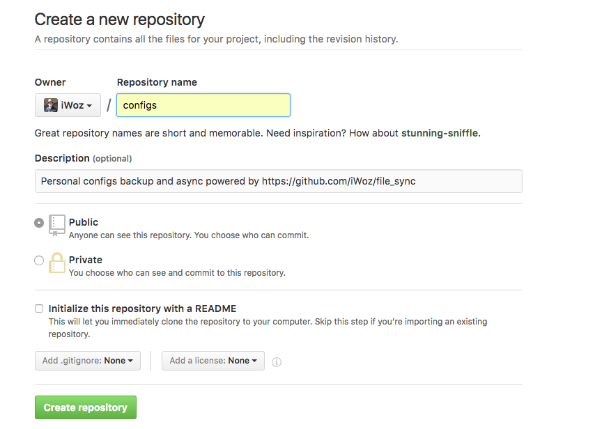
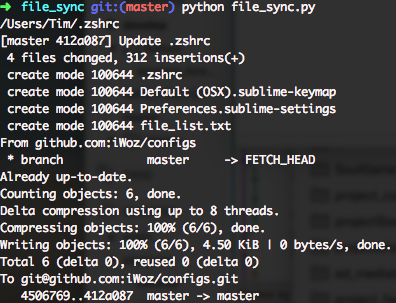
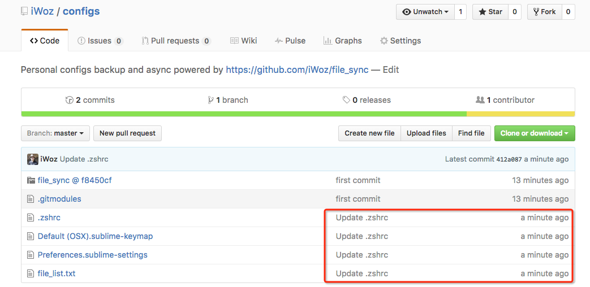

# file_sync

Synchronize your files to a git repository automatically.

When you have modified your files, files will be pushed to a remote git repository.

With git, you can know every change with your files by commits.

## Setup
* Install [git](https://git-scm.com/downloads)
* Install [Python](https://www.python.org/downloads/)

* Install [watchdog](http://pythonhosted.org/watchdog/)

	in OS X or *nix:
	
	```
	pip install watchdog
	```
	
	in Windows:
	
	```
	python -m pip install watchdog
	```

## How to use
### Make a new git repository for synchronize your files



I made a new git repository named `configs` in [Github](https://github.com/new).
	
### Setup your git repository locally

```bash
cd ~/Documents ## REPLACE ~/Documents TO WHATEVER DIR YOU LIKE

mkdir configs
cd configs

git init

## REPLACE git@github.com:iWoz/configs.git TO YOUR GIT REPOSITORY CREATED BEFORE
git remote add origin git@github.com:iWoz/configs.git 

## add submodule
git submodule add git@github.com:iWoz/file_sync.git

## stage all, commit and push to remote
git add -A
git commit -m "First commit."
git push -u origin master
## make sure you pushed successfully before you start the  next step

```

### Setup your **file_list.txt** for files to synchronize

Make a new file name `file_list.txt` in root of your git repository.

For example, contents in my file_list.txt are :
 	
 ```planitext
/Users/Tim/.zshrc
/Users/Tim/Library/Application Support/Sublime Text 2/Packages/User/Default (OSX).sublime-keymap
/Users/Tim/Library/Application Support/Sublime Text 2/Packages/User/Preferences.sublime-settings
 ```
**Make sure one line one file in its absolute path.**

### Test
Run file_sync.py in submodule file_sync

```
cd file_sync
python file_sync.py
```

Now modify one of your files mentioned in file_list.txt.

For example, I modified .zshrc, and then logs are:



And when I check the remote git repository, all worked ok:



### Auto run when system startup
* OS X
	* make a file named `com.wuzhiwei.filesync.plist` in `~/Library/LaunchAgents/`
	* fill the plist with content below

		```
		<?xml version="1.0" encoding="UTF-8"?>
		<!DOCTYPE plist PUBLIC -//Apple Computer//DTD PLIST 1.0//EN http://www.apple.com/DTDs/PropertyList-1.0.dtd >
		<plist version="1.0">
		  <dict>
		    <key>Label</key>
		    <string>com.wuzhiwei.filesync</string>
		    <key>Program</key>
		    <!-- REPLACE BELOW TO YOUR file_sync.py PATH -->
		    <string>/Users/Tim/Documents/configs/file_sync/file_sync.py</string>
		    <key>RunAtLoad</key>
		    <true/>
		    <key>KeepAlive</key>
		    <true/>
		    <key>UserName</key>
		    <!-- REPLACE BELOW TO YOUR USERNAME -->
		    <string>Tim</string>
		    <key>StandardErrorPath</key>
		    <!-- REPLACE BELOW TO WHAT EVER PATH YOU LIKE -->
		    <string>/Users/Tim/Documents/configs/file_sync/file_sync_error.log</string>
		    <key>StandardOutPath</key>
		    <!-- REPLACE BELOW TO WHAT EVER PATH YOU LIKE -->
		    <string>/Users/Tim/Documents/configs/file_sync/file_sync_output.log</string>
		  </dict>
		</plist>
		```
	* replace to your real path or username in lines below `REPLACE BELOW TO ...`
	* load the plist to system service: `launchctl load ~/Library/LaunchAgents/com.wuzhiwei.filesync.plist`
	* *if you want to unload the autorun service:* `launchctl unload ~/Library/LaunchAgents/com.wuzhiwei.filesync.plist`
	* check if the service is run in back: `launchctl list | grep com.wuzhiwei.filesync`
	
* Windows

	I rarely use Windows, there is an ugly way to do this:
	
	* make a bat file named `file_sync.bat`
	* write `pythonw  __YOUR_DIR__\file_sync.py` in this bat
	* put this bat to your startup folder `C:\Documents and Settings\All Users\Start Menu\Programs\Startup`
	* close the console because we use `pythonw`
	* more infomation can be found in [here](http://stackoverflow.com/questions/4438020/how-to-start-a-python-file-while-window-starts)
* *nix

	I'm pretty sure you can make it happen by yourself when you use *nix :)
